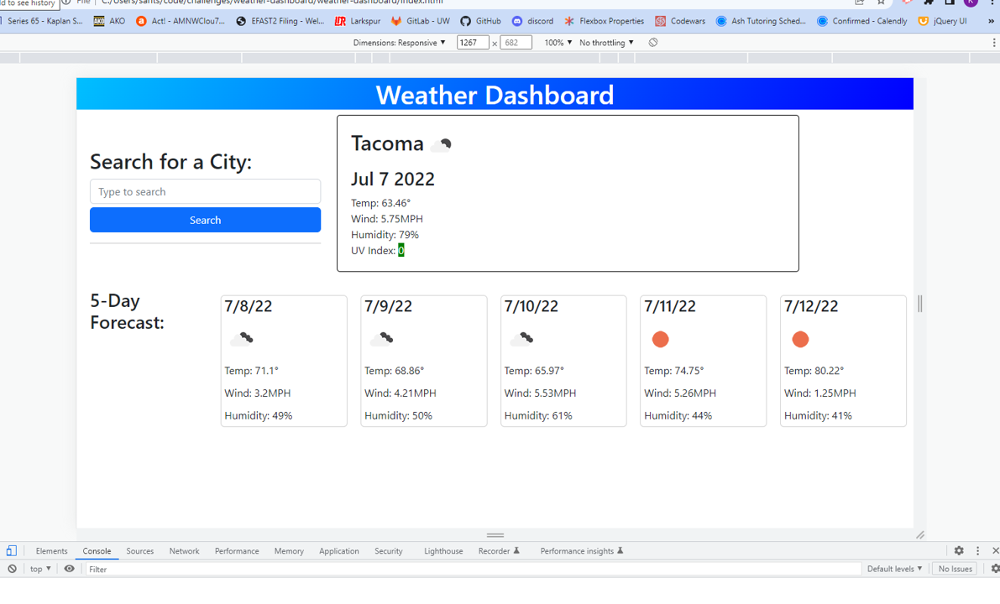

# Weather Dashboard

## Overview

This module challenge was to create a weather outlook dashboard capable of retaining multiple city searches to plan a multi-city trip. The challenge focus is utilizing a third-party API to retrieve the data and localStorage for persistent data. 

## Project Description

The Acceptance Criteria for this project is as follows:

GIVEN a weather dashboard with form inputs
WHEN I search for a city
THEN I am presented with current and future conditions for that city and that city is added to the search history

WHEN I view current weather conditions for that city
THEN I am presented with the city name, the date, an icon representation of weather conditions, the temperature, the humidity, the wind speed, and the UV index

WHEN I view the UV index
THEN I am presented with a color that indicates whether the conditions are favorable, moderate, or severe

WHEN I view future weather conditions for that city
THEN I am presented with a 5-day forecast that displays the date, an icon representation of weather conditions, the temperature, the wind speed, and the humidity

WHEN I click on a city in the search history
THEN I am again presented with current and future conditions for that city

## Run and Install

The deployed project can be accessed [here](https://kristensantee.github.io/weather-dashboard/). A screenshot for my weather dashboard can be found here:

## How to Use the Project

A user can access this project by typing in a city name into the search bar and will be presented with a box showing the current weather conditions along with a five-day forecast of with many of those same variables. The current conditions also includes a UV Index data point that changes color depending on the severity of the index point. Numbers below three will display in green, numbers between three and six will be yellow, and anything over six will be red. When a search is entered into the search bar, a new button will appear below the search bar that can be clicked to access the search again. Additionally, once a search is initiated, a red "Clear" button will appear below the five-day forecast to reset the search history and clear everything out.

## How to Contribute to the Project

This project was assigned to build familiarity with third-party APIs to build a functional weather dashboard and retain search history populated on the page.